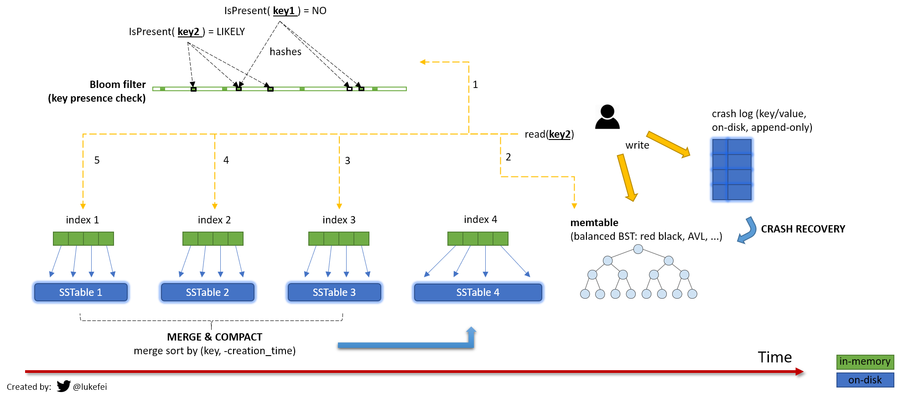

# wal-lsm-tree-sstable-indexes-summary



Indexes:
## Hash Index
### Pros:
  + O(1) Read
### Cons:
  + Hard to manage hashes in disk, it must be managed in memory
  + More data means more memory and more cost
  + Memory is not durable in case of shutdown or crash
  + Cost of range queries is O(n)

## B-Tree Index
### Pros:
  + O(log n)
  + Sorted on disk, not memory
  + Sorted, good for read queries (Range queries)
### Cons:
  + Since it is stored on disk and self-balanced(Self-balancing binary search tree), write queries are slow 

## LSM (Log Structured Merge) Tree


Implementation examples:
## WAL
```typescript
```

## LSM Tree
```typescript
```

## Bloom Filter
```typescript
```

## SSTable
```typescript
```
